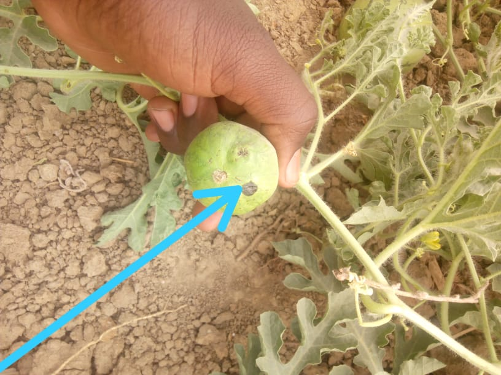
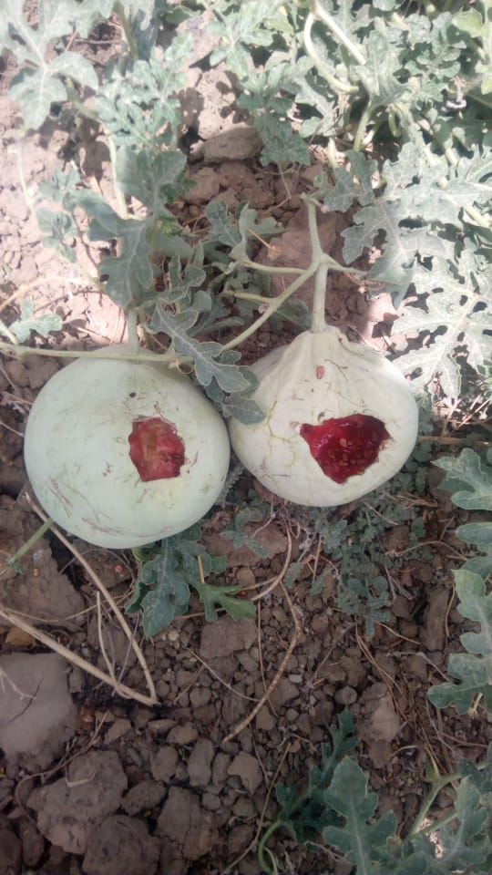
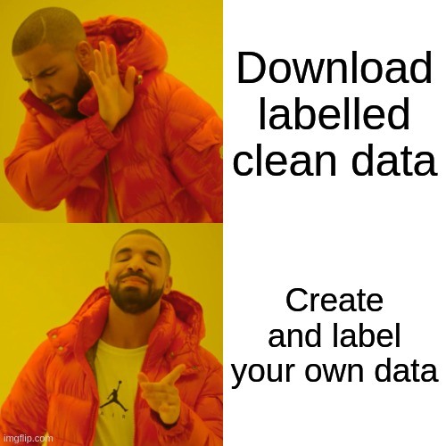

**True story!**

A friend of mine (let's call him Carmelo, coz it sounds like watermelon) is ruling a small garden with watermelon plants (digression: I love eating watermelon 😸). However, it wouldn't be a good scenario if everything was oki koki :

* Watering and putting fertilizer is inefficient, because it doesn't target the right places where water and fertilizer are needed, and these resources are expensive 
* In early stage, the fruits are vulnerable to insects attacks :   
* When the fruits reached maturity, they receive the visit of unexpected watermelon lovers, the crows, see results of their lovely visits :   

I thought for a while and came with (the not so special) idea that using machine learning + IoT can help in most of the above problems. For example an object detection computer vision model can help in :

* More effectively target areas that need water/fertilizer
* Detect/count attacked fruits
* Detect presence of attackers and ring the alarm bell 
* Count/estimate number of fruit in a given area
* ...

First step in data science project is problem definition. Here I wanted to start simple and build a simple app (web, mobile ? I dunno yet ¯\\_(ツ)_/¯) around the watermelon detection in the wild.
After problem definition, next logical step is to acquire data. To spice things up, I decided to create and label a small dataset. After all: 

So, Carmelo (remember him ?) recorded a short video of the plants, of about two and half minutes. After a little investigation about opensource image labelling tools, I found [CVAT](https://github.com/openvinotoolkit/cvat), a tool by Intel, to be the right one for me in terms of :

* easy to install: through simple a docker-compose service
* intuitive : it offers a simple web interface for labelling and also for labellers accounts administation
* functionalities : the main ones used in computer vision such as segmentation masks, key points, bounding boxes, ...

After about an equivalent of a day of working, I managed ot label around 4.7K images with bounding boxes :

> Labelling is an exhausting, task, and I needed to go back to some images multiple times to adjust the boxes. 

Data being created, I searched for a good object detection model that offers a good trade-off between accuracy and speed, as I may want to deploy the model on mobile/edge devices later.  [Yolo V5](https://github.com/ultralytics/yolov5) is one of the best in this area, so I sticked with it. 

Check this [Colab notebook](https://colab.research.google.com/github/AlkaSaliss/Pastai/blob/master/notebooks/YOLO_v5_training.ipynb) to see how to train diffent, Yolo v5 models end-to-end, from data download until model evaluation and conversion.

The trained model is deployed on streamlit and can be accessed through [this link](https://share.streamlit.io/alkasaliss/pastai/src/pastai_app.py)